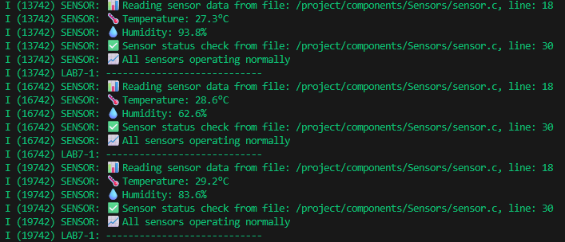

# Lab 7-1: Local Component Demo

## คำอธิบาย

การทดลองนี้แสดงการใช้งาน component ที่มีอยู่ในโฟลเดอร์ `components/Sensors/` ของ project

## สรุปคำสั่งที่ใช้ และผลลัพธ์ที่ได้

 คำสั่งที่ใช้

```bash
# เข้าไปใน project directory
cd lab7-1_Managed_Local_Component

# export environment เพื่อเรียกใช้ idf tools
. $IDF_PATH/export.sh

# กำหนด target เป็น ESP32
idf.py set-target esp32

# สั่ง build project
idf.py build

# (ถ้าทดสอบด้วย QEMU)
idf.py qemu monitor
```

